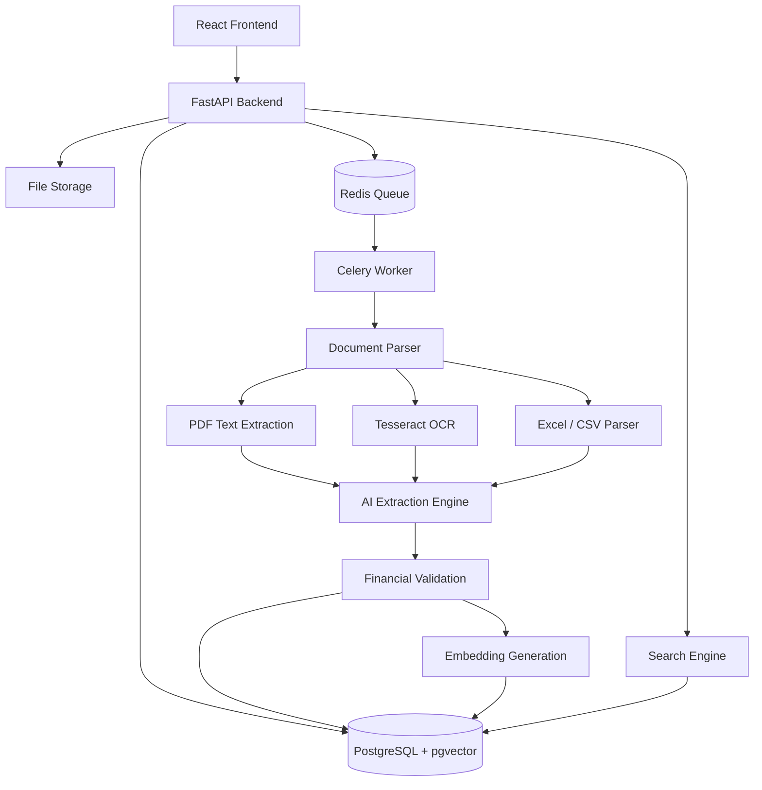

# System Architecture

```mermaid
flowchart TD
    U[React Frontend] --> API[FastAPI Backend]
    API --> FS[File Storage]
    API --> DB[(PostgreSQL + pgvector)]
    API --> R[(Redis Queue)]
    R --> W[Celery Worker]

    W --> P[Document Parser]
    P --> PDF[PDF Text Extraction]
    P --> OCR[Tesseract OCR]
    P --> XLS[Excel / CSV Parser]

    PDF --> E[AI Extraction Engine]
    OCR --> E
    XLS --> E

    E --> V[Financial Validation]
    V --> DB
    V --> IDX[Embedding Generation]
    IDX --> DB

    API --> S[Search Engine]
    S --> DB

```